Вот структура взаимодействия между файлами в модульной архитектуре:

```mermaid
graph TB
    %% Источники данных
    subgraph "DATA SOURCES"
        SYS[System APIs<br/>proc, sys, net]
        NET[Network Interfaces<br/>ip, iwconfig, ethtool]
        HW[Hardware Info<br/>lscpu, lsmem, lsusb]
        CFG[Config Files<br/>/etc/network, /etc/hostapd]
    end

    %% HTTP запросы
    subgraph "HTTP LAYER"
        REQ[HTTP Request<br/>GET/POST/PUT/DELETE]
        RESP[HTTP Response<br/>JSON/HTML]
    end

    %% Middleware слой
    subgraph "MIDDLEWARE"
        AUTH[Authentication<br/>middleware/auth.go]
        LOG[Logging<br/>middleware/logging.go]
        VALID[Validation<br/>middleware/validation.go]
        CORS[CORS Handler<br/>middleware/cors.go]
    end

    %% Роутинг
    subgraph "ROUTING"
        MAIN_R[Main Router<br/>routes/main.go]
        DASH_R[Dashboard Routes<br/>routes/dashboard.go]
        NET_R[Network Routes<br/>routes/network.go]
        SYS_R[System Routes<br/>routes/system.go]
    end

    %% Обработчики
    subgraph "HANDLERS"
        DASH_H[Dashboard Handler<br/>handlers/dashboard.go]
        NET_H[Network Handler<br/>handlers/network.go]
        SYS_H[System Handler<br/>handlers/system.go]
        API_H[API Handler<br/>handlers/api.go]
    end

    %% Валидаторы
    subgraph "VALIDATORS"
        NET_V[Network Validator<br/>validators/network.go]
        SYS_V[System Validator<br/>validators/system.go]
        USER_V[User Validator<br/>validators/user.go]
    end

    %% Сервисы
    subgraph "SERVICES"
        DASH_S[Dashboard Service<br/>services/dashboard.go]
        NET_S[Network Service<br/>services/network.go]
        SYS_S[System Service<br/>services/system.go]
        HW_S[Hardware Service<br/>services/hardware.go]
    end

    %% Модели
    subgraph "MODELS"
        NET_M[Network Models<br/>models/network.go]
        SYS_M[System Models<br/>models/system.go]
        HW_M[Hardware Models<br/>models/hardware.go]
        USER_M[User Models<br/>models/user.go]
    end

    %% Утилиты
    subgraph "UTILITIES"
        SYS_U[System Utils<br/>utils/system.go]
        NET_U[Network Utils<br/>utils/network.go]
        FILE_U[File Utils<br/>utils/file.go]
        CMD_U[Command Utils<br/>utils/command.go]
    end

    %% Конфигурация
    subgraph "CONFIG"
        APP_C[App Config<br/>config/app.go]
        NET_C[Network Config<br/>config/network.go]
        SYS_C[System Config<br/>config/system.go]
    end

    %% Шаблоны
    subgraph "TEMPLATES"
        BASE_T[Base Templates<br/>templates/base/]
        COMP_T[Components<br/>templates/components/]
        DASH_T[Dashboard Templates<br/>templates/dashboard/]
        NET_T[Network Templates<br/>templates/network/]
        SYS_T[System Templates<br/>templates/system/]
    end

    %% Статические файлы
    subgraph "STATIC FILES"
        CSS[CSS Files<br/>static/css/]
        JS[JavaScript<br/>static/js/]
        IMG[Images<br/>static/assets/]
    end

    %% Поток данных
    REQ --> AUTH
    AUTH --> LOG
    LOG --> VALID
    VALID --> MAIN_R

    MAIN_R --> DASH_R
    MAIN_R --> NET_R
    MAIN_R --> SYS_R

    DASH_R --> DASH_H
    NET_R --> NET_H
    SYS_R --> SYS_H

    DASH_H --> DASH_S
    NET_H --> NET_V
    SYS_H --> SYS_V

    NET_V --> NET_H
    SYS_V --> SYS_H
    USER_V --> AUTH

    NET_H --> NET_S
    SYS_H --> SYS_S

    DASH_S --> NET_M
    DASH_S --> SYS_M
    NET_S --> NET_M
    SYS_S --> SYS_M
    SYS_S --> HW_M

    NET_S --> NET_U
    SYS_S --> SYS_U
    HW_S --> SYS_U

    SYS_U --> CMD_U
    NET_U --> CMD_U
    
    CMD_U --> SYS
    CMD_U --> NET
    CMD_U --> HW
    CMD_U --> CFG

    DASH_H --> DASH_T
    NET_H --> NET_T
    SYS_H --> SYS_T

    DASH_T --> BASE_T
    NET_T --> BASE_T
    SYS_T --> BASE_T

    BASE_T --> COMP_T

    DASH_T --> CSS
    NET_T --> CSS
    SYS_T --> CSS

    DASH_T --> JS
    NET_T --> JS
    SYS_T --> JS

    APP_C --> DASH_S
    NET_C --> NET_S
    SYS_C --> SYS_S

    DASH_H --> RESP
    NET_H --> RESP
    SYS_H --> RESP
    API_H --> RESP

    %% Стили
    classDef dataSource fill:#e1f5fe,stroke:#01579b,stroke-width:2px
    classDef middleware fill:#f3e5f5,stroke:#4a148c,stroke-width:2px
    classDef handler fill:#e8f5e8,stroke:#1b5e20,stroke-width:2px
    classDef service fill:#fff3e0,stroke:#e65100,stroke-width:2px
    classDef model fill:#fce4ec,stroke:#880e4f,stroke-width:2px
    classDef template fill:#f1f8e9,stroke:#33691e,stroke-width:2px

    class SYS,NET,HW,CFG dataSource
    class AUTH,LOG,VALID,CORS middleware
    class DASH_H,NET_H,SYS_H,API_H handler
    class DASH_S,NET_S,SYS_S,HW_S service
    class NET_M,SYS_M,HW_M,USER_M model
    class BASE_T,COMP_T,DASH_T,NET_T,SYS_T template
```



## Источники данных и их назначение:

### Системные источники:
- **`/proc/`** - информация о процессах, памяти, CPU
- **`/sys/`** - информация о устройствах, драйверах
- **`/dev/`** - устройства системы
- **`/etc/network/`** - конфигурация сети

### Сетевые команды:
- **`ip`** - управление сетевыми интерфейсами
- **`iwconfig/iw`** - управление WiFi
- **`ethtool`** - информация об Ethernet
- **`iptables/nftables`** - управление firewall

### Аппаратные команды:
- **`lscpu`** - информация о процессоре
- **`lsmem`** - информация о памяти
- **`lsusb`** - USB устройства
- **`lspci`** - PCI устройства
- **`lsblk`** - блочные устройства

### Конфигурационные файлы:
- **`/etc/hostapd/`** - конфигурация WiFi AP
- **`/etc/dhcp/`** - конфигурация DHCP
- **`/etc/resolv.conf`** - DNS настройки
- **`/etc/ntp.conf`** - настройки времени

## Поток данных по слоям:

```
HTTP Request
     ↓
[Router] → определяет маршрут
     ↓
[Middleware] → аутентификация, логирование, валидация
     ↓
[Handler] → обрабатывает HTTP запрос
     ↓
[Validator] → проверяет входные данные
     ↓
[Service] → бизнес-логика
     ↓
[Model] → структуры данных
     ↓
[Utils] → системные вызовы, файловые операции
     ↓
[Service] → обработка результата
     ↓
[Handler] → подготовка ответа
     ↓
[Template] → рендеринг HTML (если нужен)
     ↓
HTTP Response
```

## Взаимодействие файлов внутри модуля:

```go:example_flow.go
// 1. routes/dashboard_routes.go
func SetupDashboardRoutes(e *echo.Echo) {
    e.GET("/dashboard", handlers.DashboardIndex)
}

// 2. handlers/dashboard_handler.go
func DashboardIndex(c echo.Context) error {
    data := services.GetDashboardData()
    return c.Render(200, "dashboard/index.html", data)
}

// 3. services/dashboard_service.go
func GetDashboardData() models.DashboardData {
    networkInfo := utils.GetNetworkInfo()
    systemInfo := utils.GetSystemInfo()
    return models.DashboardData{...}
}

// 4. models/dashboard_model.go
type DashboardData struct {
    NetworkInfo NetworkInfo `json:"network_info"`
    SystemInfo  SystemInfo  `json:"system_info"`
}
```

Эта структура обеспечивает четкое разделение ответственности и упрощает тестирование и поддержку кода.
