Вот структура взаимодействия между файлами в модульной архитектуре:

```mermaid
graph TD
    %% Entry Point
    A[main.go] --> B[config/app.go]
    A --> C[routes/router.go]
    
    %% Router Layer
    C --> D[routes/dashboard_routes.go]
    C --> E[routes/network_routes.go]
    C --> F[routes/system_routes.go]
    
    %% Middleware Layer
    D --> G[middleware/auth.go]
    D --> H[middleware/logging.go]
    E --> G
    F --> G
    
    %% Handler Layer
    G --> I[handlers/dashboard_handler.go]
    G --> J[handlers/network_handler.go]
    G --> K[handlers/system_handler.go]
    
    %% Service Layer
    I --> L[services/dashboard_service.go]
    J --> M[services/network_service.go]
    K --> N[services/system_service.go]
    
    %% Model Layer
    L --> O[models/dashboard_model.go]
    M --> P[models/network_model.go]
    N --> Q[models/system_model.go]
    
    %% Validation Layer
    I --> R[validators/dashboard_validator.go]
    J --> S[validators/network_validator.go]
    K --> T[validators/system_validator.go]
    
    %% Utils Layer
    L --> U[utils/system_info.go]
    M --> V[utils/network_utils.go]
    N --> W[utils/file_utils.go]
    
    %% Template Layer
    I --> X[templates/dashboard/index.html]
    J --> Y[templates/network/index.html]
    K --> Z[templates/system/index.html]
    
    %% Base Templates
    X --> AA[templates/base/layout.html]
    Y --> AA
    Z --> AA
    AA --> AB[templates/base/header.html]
    AA --> AC[templates/base/sidebar.html]
    AA --> AD[templates/base/footer.html]
    
    %% Components
    X --> AE[templates/components/cards.html]
    Y --> AF[templates/components/forms.html]
    Z --> AG[templates/components/tables.html]
    
    %% Static Assets
    X --> AH[static/css/dashboard/dashboard.css]
    Y --> AI[static/css/network/network.css]
    Z --> AJ[static/css/system/system.css]
    
    X --> AK[static/js/dashboard/dashboard.js]
    Y --> AL[static/js/network/network.js]
    Z --> AM[static/js/system/system.js]
    
    %% Configuration
    B --> AN[config/dashboard.go]
    B --> AO[config/network.go]
    B --> AP[config/system.go]
    
    %% Schemas
    R --> AQ[schemas/dashboard.json]
    S --> AR[schemas/network.json]
    T --> AS[schemas/system.json]
    
    %% Logging
    H --> AT[logs/app.log]
    L --> AU[logs/dashboard.log]
    M --> AV[logs/network.log]
    N --> AW[logs/system.log]
    
    %% Backup System
    U --> AX[.backup/]
    V --> AX
    W --> AX
    
    %% Documentation
    AY[docs/dashboard.md]
    AZ[docs/network.md]
    BA[docs/system.md]
    
    %% Testing
    BB[tests/handlers/dashboard_test.go] --> I
    BC[tests/services/network_test.go] --> M
    BD[tests/integration/system_test.go] --> K
```



## Поток данных по слоям:

```
HTTP Request
     ↓
[Router] → определяет маршрут
     ↓
[Middleware] → аутентификация, логирование, валидация
     ↓
[Handler] → обрабатывает HTTP запрос
     ↓
[Validator] → проверяет входные данные
     ↓
[Service] → бизнес-логика
     ↓
[Model] → структуры данных
     ↓
[Utils] → системные вызовы, файловые операции
     ↓
[Service] → обработка результата
     ↓
[Handler] → подготовка ответа
     ↓
[Template] → рендеринг HTML (если нужен)
     ↓
HTTP Response
```

## Взаимодействие файлов внутри модуля:

```go:example_flow.go
// 1. routes/dashboard_routes.go
func SetupDashboardRoutes(e *echo.Echo) {
    e.GET("/dashboard", handlers.DashboardIndex)
}

// 2. handlers/dashboard_handler.go
func DashboardIndex(c echo.Context) error {
    data := services.GetDashboardData()
    return c.Render(200, "dashboard/index.html", data)
}

// 3. services/dashboard_service.go
func GetDashboardData() models.DashboardData {
    networkInfo := utils.GetNetworkInfo()
    systemInfo := utils.GetSystemInfo()
    return models.DashboardData{...}
}

// 4. models/dashboard_model.go
type DashboardData struct {
    NetworkInfo NetworkInfo `json:"network_info"`
    SystemInfo  SystemInfo  `json:"system_info"`
}
```

Эта структура обеспечивает четкое разделение ответственности и упрощает тестирование и поддержку кода.
